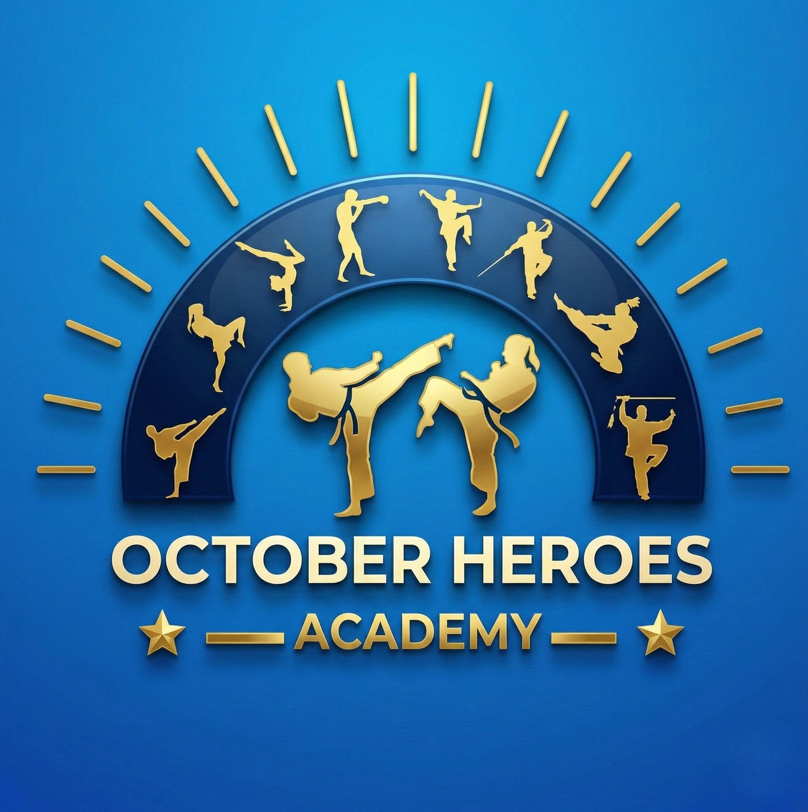

# أكاديمية أبطال أكتوبر — October Heroes Academy

<div align="center">



**أكاديمية رياضية متخصصة في الرياضات القتالية — مدينة 6 أكتوبر، مصر**

[](https://github.com/YOUR_USERNAME/october-heroes-academy/actions/workflows/deploy.yml)

</div>

---

## 🚀 التقنيات المستخدمة

| التقنية | الوصف |
|--------|-------|
| **React 19** | مكتبة UI |
| **Vite 6** | أداة البناء |
| **Tailwind CSS v4** | نظام التنسيق |
| **Framer Motion** | الحركات والانيميشن |
| **i18next** | دعم اللغتين (عربي / إنجليزي) |
| **react-helmet-async** | إدارة SEO tags |

---

## ✨ المميزات

### UI/UX
- 🌙 **Dark Theme** - نسق داكن احترافي (Dark Blue + Gold)
- 📱 **Mobile First** - تصميم يبدأ من الجوال
- 💫 **Glassmorphism** - تأثير الزجاج المضبب على البطاقات
- 🎯 **3D Tilt Cards** - بطاقات بتأثير ثلاثي الأبعاد
- 🖼️ **Image Carousel** - عرض شرائح في الهيرو
- 🔢 **Animated Counters** - عدادات متحركة للإحصاءات
- 🖼️ **Gallery + Lightbox** - معرض صور مع عرض كامل
- 💬 **WhatsApp Float** - زر واتساب طافٍ مع فقاعة محادثة
- 📲 **Mobile Sticky CTA** - شريط CTA ثابت في الجوال
- ⌛ **Loading Screen** - شاشة تحميل مع شعار متحرك
- 📊 **Scroll Progress** - شريط تقدم التمرير
- ✨ **Cursor Glow** - تأثير توهج المؤشر (ديسكتوب)

### SEO & AIO
- 📋 **JSON-LD Structured Data** - SportsClub + LocalBusiness + FAQ
- 🤖 **robots.txt** - مُحسَّن للـ AI crawlers (GPTBot, Claude, Perplexity)
- 🗺️ **sitemap.xml** - مع Image Sitemap extension
- 📄 **llms.txt** - ملف AIO لنماذج الذكاء الاصطناعي
- 🔌 **ai-plugin.json** - AI Plugin Manifest
- 🌐 **hreflang** - دعم عربي/إنجليزي
- 📱 **Open Graph + Twitter Card** - مشاركة اجتماعية

---

## 🛠️ التشغيل المحلي

```bash
# تثبيت الحزم
npm install

# تشغيل خادم التطوير
npm run dev

# البناء للإنتاج
npm run build

# فحص TypeScript
npm run lint
```

---

## 🚀 النشر على GitHub Pages

1. **رفع الكود** على GitHub Repository
2. **تفعيل GitHub Pages** من Settings → Pages → Source: GitHub Actions
3. **دفع للـ main** — الـ workflow يعمل تلقائياً

```bash
git add .
git commit -m "🚀 feat: premium UI/UX overhaul with SEO/AIO"
git push origin main
```

---

## 📁 هيكل المشروع

```
أكاديمية-أبطال-أكتوبر/
├── .github/workflows/deploy.yml   # GitHub Actions
├── public/
│   ├── robots.txt                 # SEO robots
│   ├── sitemap.xml                # XML sitemap
│   ├── llms.txt                   # AIO for AI models
│   ├── 404.html                   # SPA fallback
│   └── .well-known/ai-plugin.json # AI Plugin manifest
├── src/
│   ├── components/
│   │   ├── Navbar.tsx             # Navbar with mobile drawer
│   │   ├── HeroSection.tsx        # Hero + carousel + particles
│   │   ├── FeaturesSection.tsx    # 3D tilt cards
│   │   ├── SportsSection.tsx      # Sports cards
│   │   ├── GallerySection.tsx     # Gallery + lightbox
│   │   ├── CoachSection.tsx       # Coach cards
│   │   ├── ContactSection.tsx     # Contact form
│   │   ├── Footer.tsx             # Premium footer
│   │   ├── LoadingScreen.tsx      # Splash screen
│   │   └── FloatingCTA.tsx        # WhatsApp + mobile CTA
│   ├── App.tsx                    # Main app + SEO
│   ├── i18n.ts                    # Translations (AR + EN)
│   ├── index.css                  # Design system
│   └── main.tsx                   # Entry point
└── index.html                     # HTML entry
```

---

## 📞 تواصل

- **هاتف:** 01004945997 | 01144050600 | 01033111786
- **واتساب:** 01144050600
- **العنوان:** مدينة 6 أكتوبر، الحي الثاني، المجاورة السابعة، شارع مصطفى مشرفة
